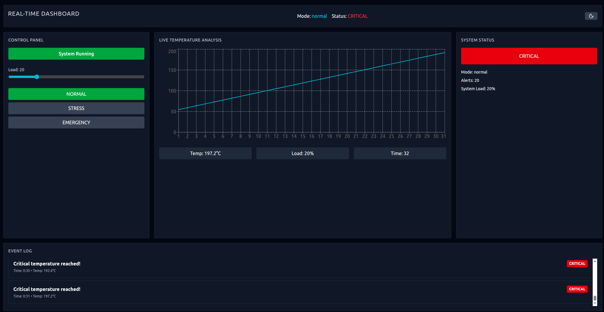
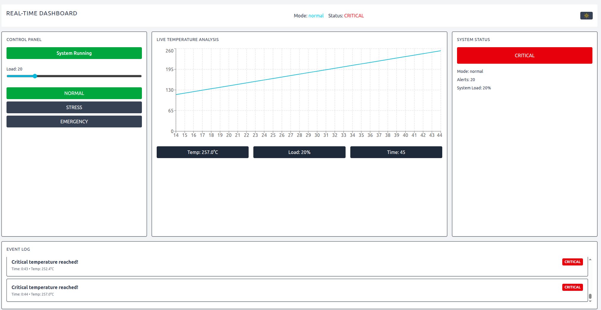

# Real-Time Control Panel App

A real-time industrial-style dashboard built with React, TypeScript, Vite, Tailwind CSS, and Recharts.

The app simulates a temperature-driven system with adjustable load and operating modes, then presents the state through a control panel, live chart, status indicators, and an event log.

## Demo

The application visualizes a real-time simulation system with dynamic temperature updates, mode switching, and live alerts.

<p align="center">
  
</p>

<p align="center">
  
</p>

## Features

- Start and stop the simulation loop from the control panel
- Adjust system load from 0 to 100%
- Switch between `normal`, `stress`, and `emergency` operating modes
- Visualize temperature history in a live line chart
- Show current temperature, load, time, and system status
- Record warning and critical alerts in an event log

## Tech Stack

- React 19
- TypeScript
- Vite
- Tailwind CSS 4
- Recharts

## Simulation Model

The simulation updates once per second.

- Initial temperature: `50°C`
- Initial load: `20%`
- Initial mode: `normal`
- History window: last `30` points
- Alert log size: last `20` events
- Alerts are emitted on status transitions into `warning` or `critical`

### Modes

- `normal`: stable baseline heating
- `stress`: increased heating rate
- `emergency`: aggressive heating and faster escalation

### Temperature Thresholds

- Warning: above `75°C`
- Critical: above `90°C`

## Application Structure

### UI Layer

- `Header`: current mode and top-level system status
- `ControlPanel`: start/stop controls, load slider, and mode selector
- `ChartPanel`: live temperature chart and current metrics
- `StatusPanel`: status badge and state summary
- `AlertPanel`: scrolling event log for warning and critical alerts

### State Layer

`useSimulation` owns the simulation state and control actions.

It exposes:

- `state`
- `running`
- `setLoad(load)`
- `setMode(mode)`
- `toggleRunning()`

### Engine Layer

The simulation engine is implemented as a pure update function in `src/simulation/engine.ts`.

It is responsible for:

- advancing time
- computing the next temperature from load and mode
- appending chart history
- generating alerts when the system crosses into warning or critical status

## Getting Started

### Prerequisites

- Node.js 20+ recommended
- npm

### Install

```bash
npm install
```

### Run the Development Server

```bash
npm run dev
```

### Build for Production

```bash
npm run build
```

### Lint the Project

```bash
npm run lint
```

### Preview the Production Build

```bash
npm run preview
```

## Project Layout

```text
src/
	components/
		layout/
		ui/
	constants/
	hooks/
	simulation/
	types/
	utils/
```

## Purpose

This project demonstrates:

- modular React UI composition
- custom-hook-based state management
- a pure simulation core separated from rendering
- a dashboard layout for real-time monitoring scenarios
